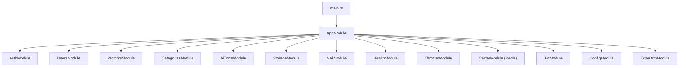
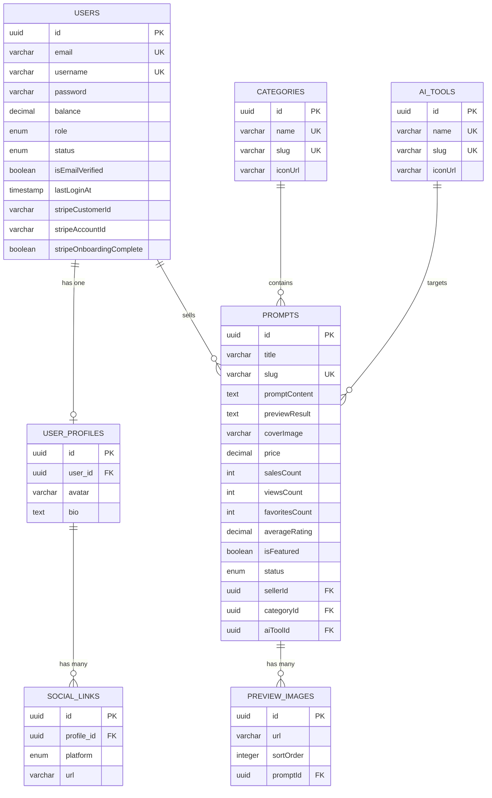

# 📊 Rapport d'Analyse Complète — PromptVerse API

> **Date** : 11 août 2026  
> **Framework** : NestJS 11 (TypeScript)  
> **Base de données** : MySQL 8.4 + TypeORM  
> **Cache** : Redis (via @keyv/redis)  
> **Stockage** : MinIO (compatible S3)  
> **Emails** : Mailpit (dev) + Nodemailer/EJS

---

## 📐 1. Architecture Globale

### 1.1 Structure du Projet



### 1.2 Modules Métier (8 modules)

| Module | Controller | Service | Entités | DTOs | Rôle |
|--------|-----------|---------|---------|------|------|
| **Auth** | ✅ | ✅ (+BcryptService) | — | 4 | Inscription, login, vérification email, reset password |
| **Users** | ✅ | ✅ | 3 (User, UserProfile, SocialLink) | 3 | Gestion profil, avatar, CRUD utilisateur |
| **Prompts** | ✅ | ✅ | 2 (Prompt, PreviewImage) | 1 | Marketplace de prompts IA |
| **Categories** | ✅ | ✅ | 1 | 2 | Gestion des catégories |
| **AI Tools** | ✅ | ✅ | 1 | 2 | Gestion des outils IA |
| **Storage** | — | ✅ | — | — | Upload/download S3 (MinIO) |
| **Mail** | — | ✅ | — | — | Envoi d'emails transactionnels |
| **Health** | ✅ | — | — | — | Health check (BDD) |

### 1.3 Schéma Relationnel de la Base de Données



---

## 🔌 2. Inventaire Complet des Endpoints

### 2.1 Auth (`/api/v1/auth`)

| Méthode | Route | Auth | Rate Limit | Description |
|---------|-------|------|------------|-------------|
| `POST` | `/register` | 🔓 Public | 2/s, 10/min, 30/h | Inscription |
| `POST` | `/login` | 🔓 Public | 2/s, 5/min, 20/h | Connexion (cookie HttpOnly) |
| `POST` | `/logout` | 🔒 Auth | Défaut | Déconnexion |
| `GET` | `/verify-email/:id/:token` | 🔓 Public | Défaut | Vérification email |
| `POST` | `/forgot-password` | 🔓 Public | Défaut | Envoi lien reset |
| `GET` | `/reset-password/:id/:token` | 🔓 Public | Défaut | Vérification lien reset |
| `POST` | `/reset-password` | 🔓 Public | Défaut | Réinitialisation mot de passe |

### 2.2 Users (`/api/v1/users`)

| Méthode | Route | Auth | Description |
|---------|-------|------|-------------|
| `GET` | `/me` | 🔒 Auth | Profil utilisateur connecté |
| `PATCH` | `/me` | 🔒 Auth | Mise à jour profil |
| `DELETE` | `/me` | 🔒 Auth | Suppression compte (soft delete) |
| `POST` | `/avatar` | 🔒 Auth | Upload avatar |
| `DELETE` | `/avatar` | 🔒 Auth | Suppression avatar |
| `GET` | `/avatar/:filename` | 🔓 Public | Affichage avatar |

### 2.3 Prompts (`/api/prompts`) ⚠️

| Méthode | Route | Auth | Description |
|---------|-------|------|-------------|
| `GET` | `/` | 🔓 Public | Liste paginée des prompts |
| `GET` | `/me` | 🔒 Auth | Prompts de l'utilisateur connecté |
| `POST` | `/` | 🔒 Auth | Création d'un prompt |
| `GET` | `/:slug` | 🔓 Public | Détail d'un prompt par slug |
| `GET` | `/category/:categorySlug` | 🔓 Public | Prompts par catégorie |
| `GET` | `/ai-tool/:aiToolSlug` | 🔓 Public | Prompts par outil IA |

### 2.4 Categories (`/api/categories`) ⚠️

| Méthode | Route | Auth | Rôles | Description |
|---------|-------|------|-------|-------------|
| `GET` | `/` | 🔓 Public | — | Liste des catégories |
| `GET` | `/archived` | 🔒 Auth+Rôle | USER, ADMIN, SUPER_ADMIN | Catégories archivées |
| `GET` | `/:slug` | 🔓 Public | — | Détail par slug |
| `POST` | `/` | 🔒 Auth+Rôle | USER, ADMIN, SUPER_ADMIN | Création |
| `PATCH` | `/:id` | 🔒 Auth+Rôle | USER, ADMIN, SUPER_ADMIN | Mise à jour |
| `PATCH` | `/:id/restore` | 🔒 Auth+Rôle | USER, ADMIN, SUPER_ADMIN | Restauration |
| `DELETE` | `/:id` | 🔒 Auth+Rôle | USER, ADMIN, SUPER_ADMIN | Archivage (soft delete) |

### 2.5 AI Tools (`/api/ai-tools`) ⚠️

| Méthode | Route | Auth | Rôles | Description |
|---------|-------|------|-------|-------------|
| `GET` | `/` | 🔓 Public | — | Liste des outils IA |
| `GET` | `/archived` | 🔒 Auth+Rôle | USER, ADMIN, SUPER_ADMIN | Outils archivés |
| `GET` | `/:slug` | 🔓 Public | — | Détail par slug |
| `POST` | `/` | 🔒 Auth+Rôle | USER, ADMIN, SUPER_ADMIN | Création |
| `PATCH` | `/:id` | 🔒 Auth+Rôle | USER, ADMIN, SUPER_ADMIN | Mise à jour |
| `PATCH` | `/:id/restore` | 🔒 Auth+Rôle | USER, ADMIN, SUPER_ADMIN | Restauration |
| `DELETE` | `/:id` | 🔒 Auth+Rôle | USER, ADMIN, SUPER_ADMIN | Archivage (soft delete) |

### 2.6 Health (`/api/health`)

| Méthode | Route | Auth | Description |
|---------|-------|------|-------------|
| `GET` | `/` | 🔓 Public | Healthcheck BDD |

**Total : 26 endpoints** (7 Auth + 6 Users + 6 Prompts + 7 Categories/AI Tools)

---

## 🔒 3. Analyse de Sécurité

### 3.1 Points Forts ✅

| Aspect | Implémentation | Détails |
|--------|----------------|---------|
| **Authentification JWT** | Cookie HttpOnly | Token stocké en cookie sécurisé, pas en localStorage |
| **Hachage mot de passe** | bcrypt (salt rounds: 10) | Standard de l'industrie |
| **Protection CSRF partielle** | `sameSite: 'lax'` | Cookie protégé des requêtes cross-origin |
| **Rate Limiting** | 3 niveaux (short/medium/long) | Protection brute-force sur login/register |
| **Helmet** | Activé | Headers de sécurité HTTP |
| **Validation des entrées** | class-validator + `whitelist: true` | Empêche l'injection de propriétés supplémentaires |
| **`forbidNonWhitelisted`** | `true` | Rejette les propriétés inconnues |
| **Sérialisation sécurisée** | `@Exclude()` sur password | Le mot de passe n'est jamais renvoyé |
| **Env Validation** | Joi schema strict | Toutes les variables requises sont vérifiées au boot |
| **Soft Delete** | `@DeleteDateColumn()` | Les données ne sont jamais supprimées physiquement |
| **Tokens d'expiration** | 15 min pour verify/reset | Les tokens expirent rapidement |

### 3.2 Vulnérabilités et Problèmes 🔴

> [!CAUTION]
> #### 🔴 CRITIQUE — Permissions trop larges sur Categories et AI Tools
> Dans [categories.controller.ts](file:///c:/FormationCDA/projet_final/PromptVerse/apps/api/src/modules/categories/categories.controller.ts#L25) et [ai-tools.controller.ts](file:///c:/FormationCDA/projet_final/PromptVerse/apps/api/src/modules/ai-tools/ai-tools.controller.ts#L25) :
> ```typescript
> @Roles(UserRoles.ADMIN, UserRoles.SUPER_ADMIN, UserRoles.USER)
> ```
> **Le rôle `USER` peut créer, modifier, supprimer et restaurer** des catégories et outils IA.  
> Cela devrait être réservé aux rôles `ADMIN` et `SUPER_ADMIN`.

> [!CAUTION]
> #### 🔴 CRITIQUE — Absence de validation du type de fichier sur l'avatar
> Dans [users.controller.ts](file:///c:/FormationCDA/projet_final/PromptVerse/apps/api/src/modules/users/users.controller.ts#L58-L73), l'upload d'avatar n'a **aucun filtre Multer** configuré. N'importe quel type de fichier peut être uploadé (exécutable, script, etc.). Le module `PromptsModule` a bien un `fileFilter`, mais pas le module Users.

> [!WARNING]
> #### 🟠 IMPORTANT — Fuite d'information sur forgot-password
> Dans [auth.service.ts](file:///c:/FormationCDA/projet_final/PromptVerse/apps/api/src/modules/auth/auth.service.ts#L160-L165) :
> ```typescript
> if (!user) throw new BadRequestException({ code: ErrorCodes.USER_NOT_FOUND });
> ```
> L'endpoint `forgot-password` révèle si un email existe dans la base. Un attaquant peut énumérer les utilisateurs. Il faudrait **toujours** retourner un message neutre.

> [!WARNING]
> #### 🟠 IMPORTANT — Pas de taille maximale de fichier sur l'upload avatar
> Le module Users n'a **aucune configuration Multer** (pas de `limits`, pas de `fileFilter`). Risque de déni de service par upload de fichiers volumineux.

> [!WARNING]
> #### 🟠 IMPORTANT — Absence de refresh token
> L'env validation exige `JWT_REFRESH_SECRET` et `JWT_REFRESH_EXPIRES_IN`, mais **aucun refresh token n'est implémenté** dans le code. Le token d'accès principal est le seul mécanisme, avec un `maxAge` de 24h sur le cookie.

> [!WARNING]
> #### 🟠 IMPORTANT — Cookie `secure: false` en développement
> Dans [auth.controller.ts](file:///c:/FormationCDA/projet_final/PromptVerse/apps/api/src/modules/auth/auth.controller.ts#L72) :
> ```typescript
> secure: process.env.NODE_ENV === 'production',
> ```
> OK pour le dev, mais vérifier que c'est bien `true` en production. L'utilisation de `process.env.NODE_ENV` directement au lieu de `ConfigService` est incohérente.

---

## ⚡ 4. Analyse de Performance

### 4.1 Points Forts ✅

| Aspect | Détails |
|--------|---------|
| **Cache Redis** | Configuré globalement avec TTL 10 min |
| **Cache sélectif** | `@UseInterceptors(CacheInterceptor)` sur `UsersController` |
| **Rate Limiting multi-niveaux** | Prévention des abus |
| **Pagination** | Implémentée sur `findAll` prompts |
| **Promise.all** | Utilisé pour paralléliser les requêtes (catégorie + aiTool dans `create`) |
| **Healthcheck** | Monitoring de la BDD via `@nestjs/terminus` |

### 4.2 Problèmes de Performance 🟡

> [!WARNING]
> #### Pas de pagination sur certains endpoints
> Les endpoints suivants retournent **tous les résultats** sans pagination :
> - `GET /categories` — [categories.service.ts](file:///c:/FormationCDA/projet_final/PromptVerse/apps/api/src/modules/categories/categories.service.ts#L53-L55)
> - `GET /ai-tools` — [ai-tools.service.ts](file:///c:/FormationCDA/projet_final/PromptVerse/apps/api/src/modules/ai-tools/ai-tools.service.ts#L53-L55)
> - `GET /prompts/me` — [prompts.service.ts](file:///c:/FormationCDA/projet_final/PromptVerse/apps/api/src/modules/prompts/prompts.service.ts#L37-L42)
> - `GET /prompts/category/:slug` — [prompts.service.ts](file:///c:/FormationCDA/projet_final/PromptVerse/apps/api/src/modules/prompts/prompts.service.ts#L60-L72)
> - `GET /prompts/ai-tool/:slug` — [prompts.service.ts](file:///c:/FormationCDA/projet_final/PromptVerse/apps/api/src/modules/prompts/prompts.service.ts#L74-L86)

> [!NOTE]
> #### Cache global commenté
> Dans [app.module.ts](file:///c:/FormationCDA/projet_final/PromptVerse/apps/api/src/modules/../app.module.ts#L86-L89), le `CacheInterceptor` global est commenté. Seul `UsersController` utilise le cache de manière explicite.

> [!NOTE]
> #### Invalidation de cache manquante
> Après un `register`, le cache `'users'` est invalidé dans le controller, mais il n'y a **pas d'invalidation** pour les catégories, AI tools, prompts, etc. après les opérations CRUD.

> [!NOTE]
> #### Pas d'index sur les colonnes de recherche
> Les colonnes `slug` des tables `prompts`, `categories`, `ai_tools` ne semblent **pas avoir d'index explicite** dans les entités TypeORM (seul `user.status` a un `@Index()`). Les contraintes `unique` créent des index implicites cependant.

---

## 🧹 5. Qualité du Code

### 5.1 Points Forts ✅

| Aspect | Détails |
|--------|---------|
| **Architecture modulaire** | Séparation claire Controller → Service → Entity |
| **DTOs documentés** | `@ApiProperty` sur tous les DTOs pour Swagger |
| **Error codes centralisés** | Constantes dans [error-codes.ts](file:///c:/FormationCDA/projet_final/PromptVerse/apps/api/src/common/errors/error-codes.ts) |
| **Enums TypeScript** | Typage fort via `UserRoles`, `UserStatus`, `PromptStatus`, etc. |
| **Décorateurs custom** | `@CurrentUser()`, `@Public()`, `@Roles()` bien implémentés |
| **Guard pattern** | `AuthGuard` global + `AuthRolesGuard` sélectif |
| **Gestion des erreurs** | Try/catch avec logging dans StorageService et MailService |
| **Rollback sur l'upload** | [prompts.service.ts](file:///c:/FormationCDA/projet_final/PromptVerse/apps/api/src/modules/prompts/prompts.service.ts#L169-L175) — Si la création de prompt échoue, les fichiers uploadés sont nettoyés |
| **Slug unique** | Combinaison `slugify` + `randomUUID` fragment pour unicité |
| **URI Versioning** | `VersioningType.URI` activé (v1) |
| **Swagger** | Documentation API auto-générée avec cookie auth |

### 5.2 Problèmes de Code 🔴

> [!CAUTION]
> #### Versioning incohérent entre controllers
> Les controllers `AuthController` et `UsersController` utilisent `version: '1'` :
> ```typescript
> @Controller({ path: 'auth', version: '1' })
> ```
> Mais `PromptsController`, `CategoriesController` et `AiToolsController` **n'ont pas de version** :
> ```typescript
> @Controller('prompts')  // ❌ Pas de version
> ```
> **Impact** : Les endpoints sont accessibles via `/api/prompts` au lieu de `/api/v1/prompts`.

> [!WARNING]
> #### Duplication de la logique `generateVerificationLink`
> La méthode `generateVerificationLink` est dupliquée dans :
> - [auth.service.ts](file:///c:/FormationCDA/projet_final/PromptVerse/apps/api/src/modules/auth/auth.service.ts#L236-L242)
> - [users.service.ts](file:///c:/FormationCDA/projet_final/PromptVerse/apps/api/src/modules/users/users.service.ts#L188-L194)
> 
> Devrait être dans un service utilitaire partagé.

> [!WARNING]
> #### Commentaire trompeur dans prompts.module.ts
> Dans [prompts.module.ts](file:///c:/FormationCDA/projet_final/PromptVerse/apps/api/src/modules/prompts/prompts.module.ts#L29) :
> ```typescript
> limits: { fileSize: 1024 * 1024 * 3 }, // 50 megabytes  ← FAUX
> ```
> Le commentaire dit « 50 megabytes » mais la limite est de **3 Mo** (`3 * 1024 * 1024`).

> [!WARNING]
> #### Description incorrecte dans UpdateUserDto
> Dans [update-user.dto.ts](file:///c:/FormationCDA/projet_final/PromptVerse/apps/api/src/modules/users/dto/update-user.dto.ts#L30-L33) :
> ```typescript
> @ApiProperty({
>   description: 'The email of the user',  // ← Devrait être "The bio of the user"
>   example: 'abduljaber@gmail.com',        // ← Devrait être un exemple de bio
> })
> bio?: string;
> ```

> [!NOTE]
> #### Manque d'endpoints CRUD pour Prompts
> Le `PromptsController` n'a **pas** d'endpoints `PATCH` (mise à jour) ni `DELETE` (suppression) pour les prompts. Un vendeur ne peut pas modifier ou supprimer ses propres prompts.

> [!NOTE]
> #### `findAll` des prompts ne retourne pas le total
> La méthode [findAll](file:///c:/FormationCDA/projet_final/PromptVerse/apps/api/src/modules/prompts/prompts.service.ts#L28-L35) ne retourne pas le nombre total de prompts, ce qui empêche la pagination côté client (impossible de connaître le nombre de pages).

> [!NOTE]
> #### Type `price` incohérent
> Dans [prompt.entity.ts](file:///c:/FormationCDA/projet_final/PromptVerse/apps/api/src/modules/prompts/entities/prompt.entity.ts#L39), `price` est typé `string` (à cause du `decimal`), mais dans [create-prompt.dto.ts](file:///c:/FormationCDA/projet_final/PromptVerse/apps/api/src/modules/prompts/dto/create-prompt.dto.ts#L51), il est typé `number`. La conversion `.toFixed(2)` dans le service retourne un `string`, ce qui fonctionne mais est source de confusion.

---

## 🏗️ 6. Infrastructure & DevOps

### 6.1 Services Docker Compose

| Service | Image | Port | Rôle |
|---------|-------|------|------|
| **database** | mysql:8.4 | 3306 | Base de données principale |
| **redis** | redis:alpine | 6379 | Cache applicatif |
| **redisinsight** | redislabs/redisinsight | 5540 | GUI Redis |
| **minio** | minio/minio | 9000/9001 | Stockage objet S3-compatible |
| **mailpit** | axllent/mailpit | 1025/8025 | Catch-all mail (dev) |

### 6.2 Dépendances Clés

| Catégorie | Package | Version |
|-----------|---------|---------|
| Framework | @nestjs/core | ^11.0.1 |
| ORM | typeorm | ^1.1.0 |
| BDD | mysql2 | ^3.23.2 |
| Auth | @nestjs/jwt | ^11.0.2 |
| Crypto | bcrypt | ^6.0.0 |
| Validation | class-validator | ^0.15.1 |
| Cache | cache-manager + @keyv/redis | ^7.2.9 / ^5.1.6 |
| Stockage | @aws-sdk/client-s3 | ^3.1105.0 |
| Sécurité | helmet | ^8.3.0 |
| Rate Limiting | @nestjs/throttler | ^6.5.0 |
| Mail | @nestjs-modules/mailer + nodemailer | ^2.3.7 / ^9.0.4 |
| Docs API | @nestjs/swagger | ^11.4.6 |
| Health | @nestjs/terminus | ^11.1.1 |

### 6.3 Migrations

| # | Fichier | Contenu |
|---|---------|---------|
| 1 | `1785957492238-users-entities.ts` | Tables `users`, `user_profiles`, `social_links` |
| 2 | `1786310926521-ai-tools-entitie.ts` | Table `ai_tools` |
| 3 | `1786314023782-categories-entitie.ts` | Table `categories` |
| 4 | `1786318727869-prompts-entities.ts` | Tables `prompts`, `preview_images` |

---

## 🧪 7. Tests

> [!CAUTION]
> #### Aucun test unitaire
> Le projet ne contient **aucun fichier `*.spec.ts`** dans le répertoire `src/`. Seul le fichier de test E2E par défaut de NestJS (`test/app.e2e-spec.ts`) est présent.
> 
> **Impact** : Aucune couverture de test. Pas de CI/CD possible avec confiance.

---

## 📋 8. Tableau Récapitulatif des Points à Corriger

### Par priorité

| # | Priorité | Catégorie | Problème | Fichier(s) concerné(s) |
|---|----------|-----------|----------|------------------------|
| 1 | 🔴 Critique | Sécurité | Rôle `USER` peut CRUD catégories/AI tools | [categories.controller.ts](file:///c:/FormationCDA/projet_final/PromptVerse/apps/api/src/modules/categories/categories.controller.ts), [ai-tools.controller.ts](file:///c:/FormationCDA/projet_final/PromptVerse/apps/api/src/modules/ai-tools/ai-tools.controller.ts) |
| 2 | 🔴 Critique | Sécurité | Pas de filtre fichier sur upload avatar | [users.controller.ts](file:///c:/FormationCDA/projet_final/PromptVerse/apps/api/src/modules/users/users.controller.ts) |
| 3 | 🔴 Critique | Tests | Aucun test unitaire | Tout le projet |
| 4 | 🟠 Important | Sécurité | Énumération d'emails sur forgot-password | [auth.service.ts](file:///c:/FormationCDA/projet_final/PromptVerse/apps/api/src/modules/auth/auth.service.ts#L160) |
| 5 | 🟠 Important | Sécurité | Pas de limite de taille sur avatar upload | [users.module.ts](file:///c:/FormationCDA/projet_final/PromptVerse/apps/api/src/modules/users/users.module.ts) |
| 6 | 🟠 Important | Architecture | Versioning manquant sur 3 controllers | [prompts.controller.ts](file:///c:/FormationCDA/projet_final/PromptVerse/apps/api/src/modules/prompts/prompts.controller.ts), [categories.controller.ts](file:///c:/FormationCDA/projet_final/PromptVerse/apps/api/src/modules/categories/categories.controller.ts), [ai-tools.controller.ts](file:///c:/FormationCDA/projet_final/PromptVerse/apps/api/src/modules/ai-tools/ai-tools.controller.ts) |
| 7 | 🟠 Important | Fonctionnel | Pas de PATCH/DELETE pour les prompts | [prompts.controller.ts](file:///c:/FormationCDA/projet_final/PromptVerse/apps/api/src/modules/prompts/prompts.controller.ts) |
| 8 | 🟠 Important | Auth | Refresh token non implémenté | [auth.service.ts](file:///c:/FormationCDA/projet_final/PromptVerse/apps/api/src/modules/auth/auth.service.ts) |
| 9 | 🟡 Moyen | Performance | Pas de pagination sur certains endpoints | Services categories, ai-tools, prompts |
| 10 | 🟡 Moyen | Performance | Pas de total count en pagination | [prompts.service.ts](file:///c:/FormationCDA/projet_final/PromptVerse/apps/api/src/modules/prompts/prompts.service.ts#L28) |
| 11 | 🟡 Moyen | Code | Duplication `generateVerificationLink` | [auth.service.ts](file:///c:/FormationCDA/projet_final/PromptVerse/apps/api/src/modules/auth/auth.service.ts#L236), [users.service.ts](file:///c:/FormationCDA/projet_final/PromptVerse/apps/api/src/modules/users/users.service.ts#L188) |
| 12 | 🟡 Moyen | Performance | Invalidation cache manquante | Controllers categories, ai-tools, prompts |
| 13 | 🟢 Mineur | Code | Commentaire taille fichier incorrect | [prompts.module.ts](file:///c:/FormationCDA/projet_final/PromptVerse/apps/api/src/modules/prompts/prompts.module.ts#L29) |
| 14 | 🟢 Mineur | Docs | Description incorrecte sur `bio` dans DTO | [update-user.dto.ts](file:///c:/FormationCDA/projet_final/PromptVerse/apps/api/src/modules/users/dto/update-user.dto.ts#L30) |
| 15 | 🟢 Mineur | Code | Type `price` incohérent string/number | [prompt.entity.ts](file:///c:/FormationCDA/projet_final/PromptVerse/apps/api/src/modules/prompts/entities/prompt.entity.ts#L39) |

---

## 📊 9. Métriques du Projet

| Métrique | Valeur |
|----------|--------|
| **Nombre total de fichiers source** | ~45 fichiers `.ts` |
| **Nombre de modules** | 8 |
| **Nombre d'endpoints** | 26 |
| **Nombre d'entités** | 7 |
| **Nombre de DTOs** | 12 |
| **Nombre de guards** | 3 |
| **Nombre de décorateurs custom** | 3 |
| **Nombre de migrations** | 4 |
| **Couverture de tests** | 0% |
| **Templates d'email** | 2 (verify-email, reset-password) |

---

## 🎯 10. Score Global

```
┌────────────────────────────────┬───────┐
│ Critère                        │ Score │
├────────────────────────────────┼───────┤
│ 🏗️ Architecture               │ 8/10  │
│ 🔒 Sécurité                   │ 5/10  │
│ ⚡ Performance                 │ 6/10  │
│ 🧹 Qualité du Code            │ 7/10  │
│ 📚 Documentation (Swagger)    │ 7/10  │
│ 🧪 Tests                      │ 0/10  │
│ 🏗️ Infrastructure (Docker)    │ 8/10  │
├────────────────────────────────┼───────┤
│ 📊 SCORE GLOBAL                │ 5.9/10│
└────────────────────────────────┴───────┘
```

> [!IMPORTANT]
> **Le projet est architecturalement solide** avec une bonne séparation des concerns et des patterns NestJS bien utilisés. Les **failles de sécurité (permissions, validation fichier)** et l'**absence totale de tests** sont les points les plus urgents à corriger avant un déploiement en production.

---

## 💡 11. Recommandations Prioritaires

### Action immédiate (avant déploiement)
1. **Corriger les permissions** : Restreindre CRUD categories/AI tools aux ADMIN et SUPER_ADMIN
2. **Ajouter le filtre et la limite de fichier** sur l'upload avatar dans UsersModule
3. **Neutraliser la réponse** de `forgot-password` pour empêcher l'énumération d'emails
4. **Ajouter le versioning** `version: '1'` sur les 3 controllers manquants

### Court terme
5. **Implémenter les tests unitaires** pour les services critiques (Auth, Users, Prompts)
6. **Ajouter PATCH/DELETE** sur les prompts
7. **Implémenter le refresh token**
8. **Ajouter la pagination** sur tous les endpoints de listing

### Moyen terme
9. **Ajouter un système de recherche** (full-text search sur les prompts)
10. **Implémenter Stripe** (les champs sont prêts dans l'entité User)
11. **Ajouter Google OAuth** (les variables d'env sont validées mais non utilisées)
12. **Mettre en place le CI/CD** avec exécution automatique des tests
