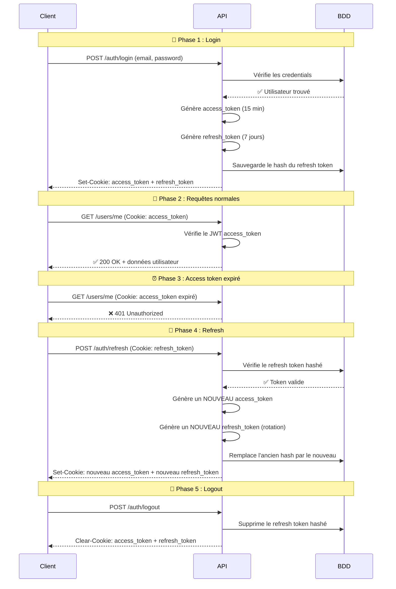

# 🔄 Comprendre et Implémenter le Refresh Token

## 📚 1. Le Problème : Pourquoi un seul token ne suffit pas ?

### Situation actuelle (Access Token seul)

Aujourd'hui, ton API fonctionne avec **un seul JWT** (access token) stocké dans un cookie HttpOnly avec un `maxAge` de **24 heures**.

```
Utilisateur se connecte → reçoit un access_token (24h) → l'utilise pour chaque requête
```

**Problèmes :**

| Problème | Explication |
|----------|-------------|
| ⏰ **Token longue durée = risque** | Si le token est volé (XSS, interception réseau...), l'attaquant a accès pendant 24h |
| 🔒 **Pas de révocation** | Impossible d'invalider un token JWT sans mécanisme supplémentaire |
| 😤 **Mauvaise UX si courte durée** | Si on réduit la durée à 15 min pour la sécurité, l'utilisateur doit se re-connecter constamment |

### Le dilemme

> **Sécurité** = token courte durée (15 min) → mauvaise expérience utilisateur  
> **UX** = token longue durée (24h) → risque de sécurité

---

## 💡 2. La Solution : Access Token + Refresh Token

Le refresh token résout ce dilemme en utilisant **deux tokens** :

| | Access Token | Refresh Token |
|---|---|---|
| **Durée de vie** | Courte (15 min) | Longue (7 jours) |
| **Usage** | Authentifier chaque requête API | Obtenir un nouvel access token |
| **Stockage** | Cookie HttpOnly | Cookie HttpOnly (séparé) |
| **Fréquence d'envoi** | À chaque requête | Seulement quand l'access token expire |
| **Contenu** | `{ sub, role }` | `{ sub }` (minimal) |
| **Risque si volé** | Limité (expire vite) | Plus grave, mais protégé par rotation |

### Le principe en une phrase

> L'access token ouvre les portes. Le refresh token permet de **refaire une clé** quand l'ancienne expire.

---

## 🔁 3. Le Flux Complet



### Rotation du Refresh Token

À chaque refresh, on génère un **nouveau** refresh token et on invalide l'ancien. Si un attaquant vole un refresh token et l'utilise, le vrai utilisateur recevra une erreur au prochain refresh → **détection d'intrusion**.

---

## 🛠️ 4. Implémentation dans PromptVerse

### 4.1 Vue d'ensemble des modifications


### 4.2 Fichiers à modifier

| Fichier | Modification |
|---------|-------------|
| `user.entity.ts` | Ajouter la colonne `hashedRefreshToken` |
| `auth.service.ts` | Ajouter `generateRefreshToken()`, `refreshTokens()`, `revokeRefreshToken()` |
| `auth.controller.ts` | Ajouter l'endpoint `POST /auth/refresh` et modifier login/logout |
| `auth.guard.ts` | Aucune modification nécessaire |
| `users.service.ts` | Ajouter `updateRefreshToken()` |

---

### 4.3 Étape 1 — Modifier l'entité User

Ajouter une colonne pour stocker le **hash** du refresh token (jamais en clair).

```typescript
// src/modules/users/entities/user.entity.ts

// Ajouter cette colonne après resetPasswordTokenExpiresAt :
@Column({ type: 'varchar', length: 255, nullable: true })
@Exclude()
hashedRefreshToken: string | null;
```

> [!IMPORTANT]
> On stocke le **hash** du refresh token, pas le token en clair. Si la BDD est compromise, les tokens sont inutilisables.

Après cette modification, **générer une migration** :
```bash
npm run migration:generate -- src/database/migrations/add-hashed-refresh-token
npm run migration:run
```

---

### 4.3 Étape 2 — Ajouter la méthode dans UsersService

```typescript
// src/modules/users/users.service.ts

async updateRefreshToken(userId: string, hashedRefreshToken: string | null): Promise<void> {
  await this.usersRepository.update(userId, { hashedRefreshToken });
}
```

---

### 4.4 Étape 3 — Modifier AuthService

```typescript
// src/modules/auth/auth.service.ts

import { ConfigService } from '@nestjs/config';
import { JwtSignOptions } from '@nestjs/jwt';
import * as crypto from 'crypto';

@Injectable()
export class AuthService {
  constructor(
    private readonly usersService: UsersService,
    private readonly bcryptService: BcryptService,
    private readonly mailService: MailService,
    private readonly jwtService: JwtService,
    private readonly config: ConfigService,
  ) {}

  // ─── Modifier la méthode login ───
  async login(loginDto: LoginDto) {
    // ... (validation existante identique) ...

    await this.usersService.updateLastLogin(user.id);

    // Générer les deux tokens
    const accessToken = await this.generateAccessToken({
      sub: user.id,
      role: user.role,
    });

    const refreshToken = await this.generateRefreshToken({
      sub: user.id,
    });

    // Hasher et sauvegarder le refresh token
    const hashedRefreshToken = this.hashToken(refreshToken);
    await this.usersService.updateRefreshToken(user.id, hashedRefreshToken);

    return { accessToken, refreshToken };
  }

  // ─── Nouvelle méthode : refreshTokens ───
  async refreshTokens(userId: string, refreshToken: string) {
    const user = await this.usersService.findById(userId);

    if (!user || !user.hashedRefreshToken) {
      throw new UnauthorizedException({
        code: ErrorCodes.INVALID_TOKEN,
      });
    }

    // Vérifier que le refresh token correspond au hash en BDD
    const isTokenValid = this.hashToken(refreshToken) === user.hashedRefreshToken;

    if (!isTokenValid) {
      // Possible vol de token → révoquer par sécurité
      await this.usersService.updateRefreshToken(userId, null);
      throw new UnauthorizedException({
        code: ErrorCodes.INVALID_TOKEN,
      });
    }

    // Rotation : générer de nouveaux tokens
    const newAccessToken = await this.generateAccessToken({
      sub: user.id,
      role: user.role,
    });

    const newRefreshToken = await this.generateRefreshToken({
      sub: user.id,
    });

    // Sauvegarder le nouveau hash
    const newHashedRefreshToken = this.hashToken(newRefreshToken);
    await this.usersService.updateRefreshToken(user.id, newHashedRefreshToken);

    return {
      accessToken: newAccessToken,
      refreshToken: newRefreshToken,
    };
  }

  // ─── Nouvelle méthode : revokeRefreshToken ───
  async revokeRefreshToken(userId: string): Promise<void> {
    await this.usersService.updateRefreshToken(userId, null);
  }

  // ─── Méthodes privées ───

  private generateAccessToken(payload: jwtPayloadType): Promise<string> {
    return this.jwtService.signAsync(payload, {
      secret: this.config.getOrThrow<string>('JWT_SECRET'),
      expiresIn: this.config.getOrThrow<string>('JWT_EXPIRES_IN') as JwtSignOptions['expiresIn'],
    });
  }

  private generateRefreshToken(payload: { sub: string }): Promise<string> {
    return this.jwtService.signAsync(payload, {
      secret: this.config.getOrThrow<string>('JWT_REFRESH_SECRET'),
      expiresIn: this.config.getOrThrow<string>('JWT_REFRESH_EXPIRES_IN') as JwtSignOptions['expiresIn'],
    });
  }

  private hashToken(token: string): string {
    return crypto.createHash('sha256').update(token).digest('hex');
  }
}
```

> [!NOTE]
> **Pourquoi `sha256` au lieu de `bcrypt` ?**  
> Le refresh token est déjà un JWT aléatoire à haute entropie (impossible à bruteforcer). `sha256` est suffisant et **beaucoup plus rapide** que bcrypt pour les comparaisons fréquentes.

---

### 4.5 Étape 4 — Modifier AuthController

```typescript
// src/modules/auth/auth.controller.ts

@Post('login')
@Public()
@HttpCode(HttpStatus.OK)
async login(
  @Body() loginDto: LoginDto,
  @Res({ passthrough: true }) res: Response,
) {
  const { accessToken, refreshToken } = await this.authService.login(loginDto);
  const isProduction = process.env.NODE_ENV === 'production';

  // Cookie Access Token (courte durée)
  res.cookie('access_token', accessToken, {
    httpOnly: true,
    secure: isProduction,
    sameSite: 'lax',
    maxAge: 1000 * 60 * 15, // 15 minutes
  });

  // Cookie Refresh Token (longue durée)
  res.cookie('refresh_token', refreshToken, {
    httpOnly: true,
    secure: isProduction,
    sameSite: 'lax',
    path: '/api/v1/auth/refresh', // ⚡ Envoyé UNIQUEMENT sur /refresh
    maxAge: 1000 * 60 * 60 * 24 * 7, // 7 jours
  });

  return { message: 'Login successful' };
}

// ─── Nouvel endpoint : Refresh ───
@Post('refresh')
@Public()
@HttpCode(HttpStatus.OK)
async refresh(
  @Req() req: Request,
  @Res({ passthrough: true }) res: Response,
) {
  const refreshToken = req.cookies?.refresh_token as string | undefined;

  if (!refreshToken) {
    throw new UnauthorizedException({
      code: ErrorCodes.NO_TOKEN_PROVIDED,
    });
  }

  // Vérifier la signature du refresh token
  let payload: { sub: string };
  try {
    payload = await this.jwtService.verifyAsync(refreshToken, {
      secret: this.configService.getOrThrow<string>('JWT_REFRESH_SECRET'),
    });
  } catch {
    throw new UnauthorizedException({
      code: ErrorCodes.INVALID_TOKEN,
    });
  }

  // Rotation des tokens
  const tokens = await this.authService.refreshTokens(payload.sub, refreshToken);
  const isProduction = process.env.NODE_ENV === 'production';

  res.cookie('access_token', tokens.accessToken, {
    httpOnly: true,
    secure: isProduction,
    sameSite: 'lax',
    maxAge: 1000 * 60 * 15,
  });

  res.cookie('refresh_token', tokens.refreshToken, {
    httpOnly: true,
    secure: isProduction,
    sameSite: 'lax',
    path: '/api/v1/auth/refresh',
    maxAge: 1000 * 60 * 60 * 24 * 7,
  });

  return { message: 'Tokens refreshed successfully' };
}

// ─── Modifier logout ───
@Post('logout')
@HttpCode(HttpStatus.OK)
async logout(
  @CurrentUser() payload: jwtPayloadType,
  @Res({ passthrough: true }) res: Response,
) {
  // Révoquer le refresh token en BDD
  await this.authService.revokeRefreshToken(payload.sub);

  res.clearCookie('access_token', {
    httpOnly: true,
    secure: process.env.NODE_ENV === 'production',
    sameSite: 'lax',
  });

  res.clearCookie('refresh_token', {
    httpOnly: true,
    secure: process.env.NODE_ENV === 'production',
    sameSite: 'lax',
    path: '/api/v1/auth/refresh',
  });

  return { message: 'Logout successful' };
}
```

> [!TIP]
> **`path: '/api/v1/auth/refresh'`** sur le cookie refresh_token est crucial !  
> Le navigateur n'envoie ce cookie **que** sur l'endpoint `/refresh`. Cela réduit la surface d'attaque car le refresh token ne transite pas sur chaque requête API.

---

### 4.6 Étape 5 — Configuration `.env`

Les variables sont déjà validées dans ton `env.validation.ts`. Il faut juste s'assurer que les valeurs sont correctes :

```env
# .env.development
JWT_SECRET=ta_cle_secrete_de_32_caracteres_minimum
JWT_EXPIRES_IN=15m          # ← Changer de 24h à 15 min
JWT_REFRESH_SECRET=une_autre_cle_differente_de_32_chars   # ⚠️ Clé DIFFÉRENTE
JWT_REFRESH_EXPIRES_IN=7d   # 7 jours
```

> [!CAUTION]
> `JWT_SECRET` et `JWT_REFRESH_SECRET` **doivent être différents**. Si la même clé est utilisée, un access token pourrait être utilisé comme refresh token et vice-versa.

---

## 🖥️ 5. Côté Client (Frontend)

Le frontend doit intercepter les réponses 401 et tenter un refresh automatique :

```typescript
// Exemple avec Axios (intercepteur)
api.interceptors.response.use(
  (response) => response,
  async (error) => {
    const originalRequest = error.config;

    // Si 401 et pas déjà un retry
    if (error.response?.status === 401 && !originalRequest._retry) {
      originalRequest._retry = true;

      try {
        // Appeler le endpoint refresh
        await api.post('/auth/refresh');

        // Rejouer la requête originale (le nouveau cookie est auto-attaché)
        return api(originalRequest);
      } catch (refreshError) {
        // Le refresh a échoué → déconnecter l'utilisateur
        window.location.href = '/login';
        return Promise.reject(refreshError);
      }
    }

    return Promise.reject(error);
  },
);
```

---

## 📊 6. Résumé Visuel

```
┌─────────────────────────────────────────────────────────┐
│                    AVANT (actuel)                        │
│                                                         │
│  Login → access_token (24h) → chaque requête            │
│                                                         │
│  ❌ Token longue durée = risque si volé                 │
│  ❌ Pas de révocation possible                          │
└─────────────────────────────────────────────────────────┘

                         ↓ ↓ ↓

┌─────────────────────────────────────────────────────────┐
│                    APRÈS (refresh token)                 │
│                                                         │
│  Login → access_token (15m) + refresh_token (7j)        │
│                                                         │
│  ✅ Access token courte durée = risque limité           │
│  ✅ Refresh token en BDD = révocable                    │
│  ✅ Rotation automatique = détection de vol             │
│  ✅ Cookie path restreint = surface d'attaque réduite   │
└─────────────────────────────────────────────────────────┘
```

---

## 📝 7. Checklist d'Implémentation

- [ ] Ajouter `hashedRefreshToken` à l'entité `User`
- [ ] Générer et exécuter la migration
- [ ] Ajouter `updateRefreshToken()` dans `UsersService`
- [ ] Ajouter `generateRefreshToken()`, `refreshTokens()`, `revokeRefreshToken()` dans `AuthService`
- [ ] Ajouter `hashToken()` (sha256) dans `AuthService`
- [ ] Modifier le `login()` pour retourner les 2 tokens
- [ ] Ajouter l'endpoint `POST /auth/refresh`
- [ ] Modifier le `logout()` pour révoquer le refresh token
- [ ] Mettre à jour les cookies (durées + path)
- [ ] Mettre à jour `.env` : `JWT_EXPIRES_IN=15m`, `JWT_REFRESH_EXPIRES_IN=7d`
- [ ] Ajouter `addCookieAuth('refresh_token')` dans la config Swagger
- [ ] Implémenter l'intercepteur 401 côté frontend
- [ ] Tester le flux complet : login → requête → expiration → refresh → requête OK
