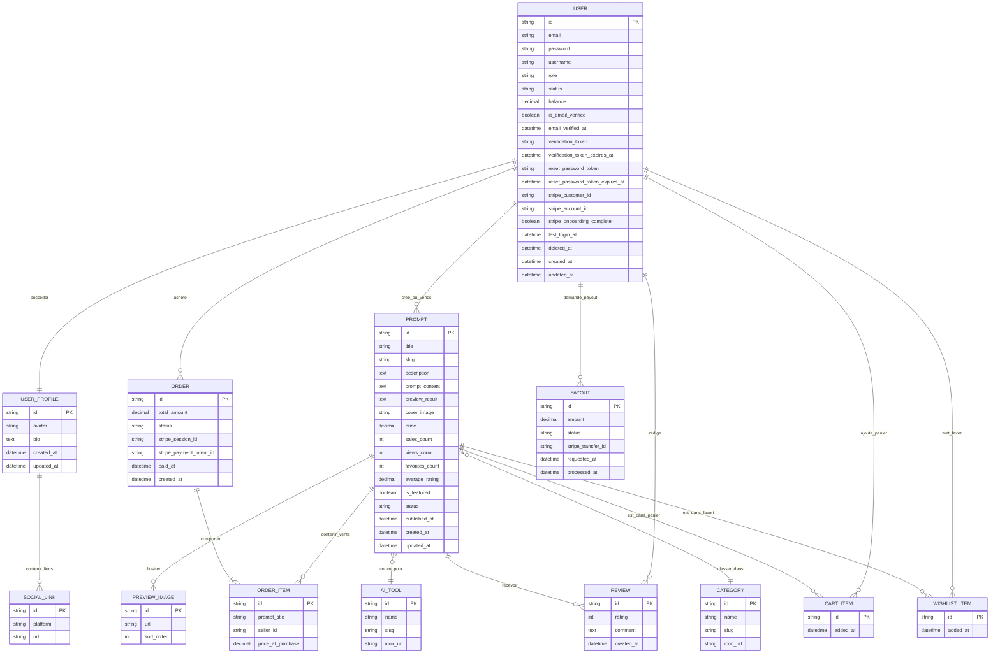

# 🗄️ Modèle Conceptuel des Données (MCD - Merise Optimisé)

## 📊 Schéma MCD (Diagramme Entity-Relationship Mermaid)

```mermaid
erDiagram
    USER {
        string id PK
        string email
        string password
        string username
        string role
        string status
        decimal balance
        boolean is_email_verified
        datetime email_verified_at
        string verification_token
        datetime verification_token_expires_at
        string reset_password_token
        datetime reset_password_token_expires_at
        string stripe_customer_id
        string stripe_account_id
        boolean stripe_onboarding_complete
        datetime last_login_at
        datetime deleted_at
        datetime created_at
        datetime updated_at
    }

    USER_PROFILE {
        string id PK
        string avatar
        text bio
        datetime created_at
        datetime updated_at
    }

    SOCIAL_LINK {
        string id PK
        string platform
        string url
    }

    PROMPT {
        string id PK
        string title
        string slug
        text description
        text prompt_content
        text preview_result
        string cover_image
        decimal price
        int sales_count
        int views_count
        int favorites_count
        decimal average_rating
        boolean is_featured
        string status
        datetime published_at
        datetime created_at
        datetime updated_at
    }

    AI_TOOL {
        string id PK
        string name
        string slug
        string icon_url
    }

    CATEGORY {
        string id PK
        string name
        string slug
        string icon_url
    }

    PREVIEW_IMAGE {
        string id PK
        string url
        int sort_order
    }

    ORDER {
        string id PK
        decimal total_amount
        string status
        string stripe_session_id
        string stripe_payment_intent_id
        datetime paid_at
        datetime created_at
    }

    ORDER_ITEM {
        string id PK
        string prompt_title
        string seller_id
        decimal price_at_purchase
    }

    REVIEW {
        string id PK
        int rating
        text comment
        datetime created_at
    }

    CART_ITEM {
        string id PK
        datetime added_at
    }

    WISHLIST_ITEM {
        string id PK
        datetime added_at
    }

    PAYOUT {
        string id PK
        decimal amount
        string status
        string stripe_transfer_id
        datetime requested_at
        datetime processed_at
    }

    %% Associations avec Cardinalités
    USER ||--|| USER_PROFILE : "posseder"
    USER_PROFILE ||--o{ SOCIAL_LINK : "contenir_liens"
    USER ||--o{ PROMPT : "cree_ou_vends"
    USER ||--o{ ORDER : "achete"
    USER ||--o{ REVIEW : "redige"
    USER ||--o{ CART_ITEM : "ajoute_panier"
    USER ||--o{ WISHLIST_ITEM : "met_favori"
    USER ||--o{ PAYOUT : "demande_payout"

    PROMPT ||--o{ PREVIEW_IMAGE : "illustrer"
    PROMPT ||--o{ ORDER_ITEM : "contenir_vente"
    PROMPT ||--o{ REVIEW : "recevoir"
    PROMPT ||--o{ CART_ITEM : "est_dans_panier"
    PROMPT ||--o{ WISHLIST_ITEM : "est_dans_favori"
    PROMPT }o--|| AI_TOOL : "concu_pour"
    PROMPT }o--|| CATEGORY : "classer_dans"

    ORDER ||--|{ ORDER_ITEM : "comporter"
```
