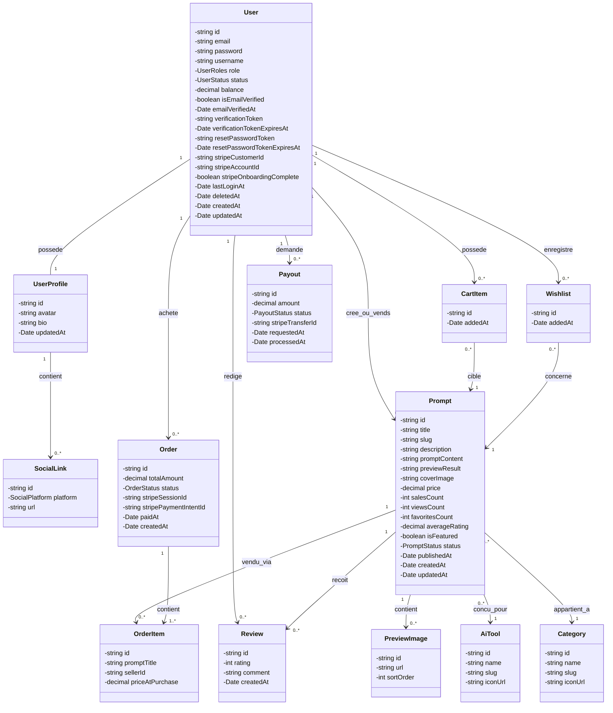

# 📐 Diagramme de Classes UML (Domain & Entities TypeORM - Optimisé)

## 📊 Diagramme Mermaid — Classes UML



---

## 🏷️ Énumérations Métier

```typescript
export enum UserRoles {
  USER = 'USER',          // Achète ET Vend des prompts
  ADMIN = 'ADMIN',        // Gestion du site
  SUPER_ADMIN = 'SUPER_ADMIN', // Droits totaux
}

export enum UserStatus {
  PENDING = 'PENDING',
  ACTIVE = 'ACTIVE',
  BANNED = 'BANNED',
}

export enum SocialPlatform {
  WEBSITE = 'WEBSITE',
  TWITTER = 'TWITTER',
  INSTAGRAM = 'INSTAGRAM',
  GITHUB = 'GITHUB',
  LINKEDIN = 'LINKEDIN',
  YOUTUBE = 'YOUTUBE',
  TIKTOK = 'TIKTOK',
  DISCORD = 'DISCORD',
}

export enum PromptStatus {
  PUBLISHED = 'PUBLISHED', // En ligne immédiatement à la création
  ARCHIVED = 'ARCHIVED',   // Masqué par le vendeur ou l'admin
}

export enum OrderStatus {
  PENDING = 'PENDING',
  PAID = 'PAID',
  REFUNDED = 'REFUNDED',
  FAILED = 'FAILED',
}

export enum PayoutStatus {
  PENDING = 'PENDING',
  PROCESSING = 'PROCESSING',
  PROCESSED = 'PROCESSED',
  FAILED = 'FAILED',
}
```
