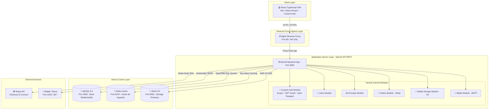

# 📐 Diagramme d'Architecture Applicative (Composants & Infra)

## 📊 Diagramme Mermaid — Architecture Globale Multicouche Répartie

```mermaid
graph TB
    subgraph ClientLayer ["Client Layer"]
        SPA["💻 React TypeScript SPA<br/>Vite / React Router / Context Auth"]
    end

    subgraph ProxyLayer ["Reverse Proxy Ingress Layer"]
        Nginx["🌐 Nginx Reverse Proxy<br/>Port 80 / 443 SSL"]
    end

    subgraph AppServerLayer ["Application Server Layer - NestJS API REST"]
        API["⚙️ NestJS Backend App - Port 3000"]
        
        subgraph Modules ["NestJS Internal Modules"]
            AuthMod["🔑 Custom Auth Module<br/>bcrypt + JWT Guard - Sans Passport"]
            UserMod["👤 Users Module"]
            PromptMod["✍️ Prompts Module"]
            OrderMod["🛒 Orders Module - Stripe"]
            MediaMod["📁 Media Storage Module - S3"]
            MailMod["📧 Mailer Module - SMTP"]
        end

        API --> AuthMod
        API --> UserMod
        API --> PromptMod
        API --> OrderMod
        API --> MediaMod
        API --> MailMod
    end

    subgraph DataLayer ["Data & Cache Layer"]
        MySQL[("💾 MySQL 8.0<br/>Port 3306 - Base Relationnelle")]
        Redis[("⚡ Redis Cache<br/>Port 6379 - Cache de requetes")]
        MinIO[("📁 MinIO S3<br/>Port 9000 - Storage Previews")]
    end

    subgraph ExtServices ["External Services"]
        Stripe["💳 Stripe API<br/>Checkout & Connect"]
        SMTP["📧 Mailpit / Brevo<br/>Port 1025 / 587"]
    end

    %% Connexions Client -> Ingress
    SPA -->|HTTP / HTTPS| Nginx
    Nginx -->|Proxy Pass /api| API

    %% Connexions Backend -> Data Layer
    API -->|TypeORM SQL Queries| MySQL
    API -->|Key-Value Caching| Redis
    API -->|AWS S3 SDK| MinIO
    API -->|Stripe Node SDK| Stripe
    API -->|Nodemailer SMTP| SMTP
```
