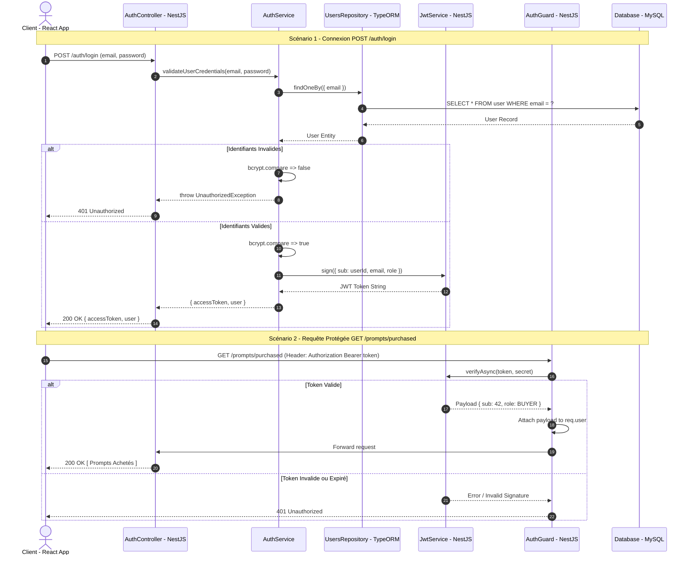

# 📐 Diagramme de Séquence UML — Authentification JWT Natif (Sans Passport)

## 🎯 Périmètre du Flux
Ce diagramme détaille l'inscription (`/auth/register`), la connexion (`/auth/login`) et l'interception des requêtes protégées via un `AuthGuard` natif NestJS (sans Passport, sans OAuth).

---

## 📊 Diagramme Mermaid — Séquence Auth

