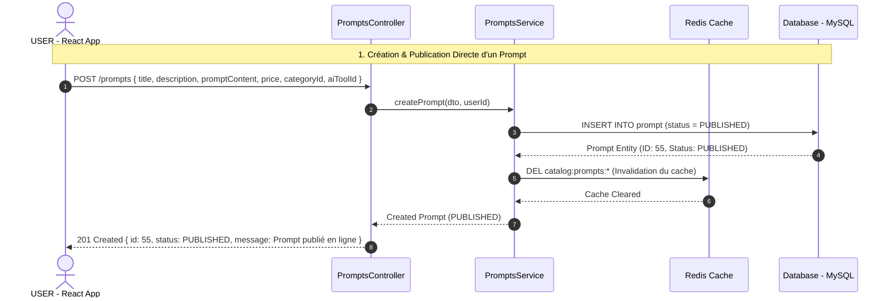

# 📐 Diagramme de Séquence UML — Publication Directe d'un Prompt

## 🎯 Périmètre du Flux
Ce diagramme détaille la création et la publication immédiate d'un prompt par un utilisateur (`USER`), l'invalidation du cache Redis, et sa disponibilité instantanée dans le catalogue public.

---

## 📊 Diagramme Mermaid — Séquence Publication Directe

