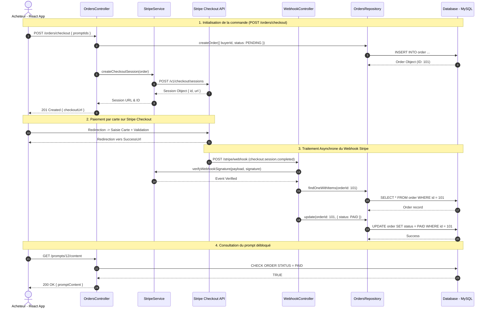

# 📐 Diagramme de Séquence UML — Achat via Stripe Checkout

## 🎯 Périmètre du Flux
Détail du parcours d'achat d'un prompt : sélection du prompt, création de la session Stripe Checkout sur le backend NestJS, redirection vers la page de paiement sécurisée Stripe, puis réception asynchrone du webhook Stripe confirmant le paiement et débloquant l'accès au prompt.

---

## 📊 Diagramme Mermaid — Séquence Achat

