# 📐 Diagramme de Cas d'Utilisation UML (Use Cases - 3 Rôles)

## 🎯 Aperçu des Acteurs
- **Visiteur** : Utilisateur non authentifié.
- **USER** : Utilisateur unique (Acheteur ET Vendeur).
- **ADMIN** : Modérateur de la plateforme.
- **SUPER_ADMIN** : Administrateur suprême.

---

## 📊 Diagramme Mermaid — Use Cases

```mermaid
graph TD
    subgraph Acteurs
        Visiteur["👤 Visiteur"]
        UserRole["👤 USER (Acheteur & Vendeur)"]
        AdminRole["🛡️ ADMIN"]
        SuperAdminRole["👑 SUPER_ADMIN"]
    end

    subgraph PromptVerse System
        %% Cas Visiteur
        UC_Naviguer["Consulter le catalogue"]
        UC_Rechercher["Rechercher / Filtrer des prompts"]
        UC_Inscrire["S'inscrire (Email / Password)"]
        UC_Connecter["Se connecter (Obtenir JWT)"]

        %% Cas USER (Acheteur + Vendeur)
        UC_Acheter["Acheter un prompt (Stripe Checkout)"]
        UC_ConsulterAchat["Accéder aux prompts achetés"]
        UC_Vendre["Créer / Vendre ses propres prompts"]
        UC_Payout["Gérer son solde & Demander versement"]
        UC_Noter["Laisser une note et un avis"]

        %% Cas ADMIN
        UC_Moderation["Modérer les prompts (Approuver / Rejeter)"]
        UC_GererUser["Gérer les utilisateurs (Activer / Bannir)"]

        %% Cas SUPER_ADMIN
        UC_PromouvoirAdmin["Gérer les Admins"]
        UC_StatsSysteme["Consulter les métriques financières globales"]
    end

    %% Relations Visiteur
    Visiteur --> UC_Naviguer
    Visiteur --> UC_Rechercher
    Visiteur --> UC_Inscrire
    Visiteur --> UC_Connecter

    %% Relations USER (Acheteur & Vendeur)
    UserRole --> UC_Naviguer
    UserRole --> UC_Rechercher
    UserRole --> UC_Acheter
    UserRole --> UC_ConsulterAchat
    UserRole --> UC_Vendre
    UserRole --> UC_Payout
    UserRole --> UC_Noter

    %% Relations ADMIN
    AdminRole --> UC_Moderation
    AdminRole --> UC_GererUser

    %% Relations SUPER_ADMIN
    SuperAdminRole --> UC_Moderation
    SuperAdminRole --> UC_GererUser
    SuperAdminRole --> UC_PromouvoirAdmin
    SuperAdminRole --> UC_StatsSysteme
```

---

## 📝 Description des Cas d'Utilisation Majeurs

| Identifiant | Intitulé | Acteur Principal | Description |
|---|---|---|---|
| **UC-01** | Inscription & Connexion | Visiteur | Création de compte `USER` et connexion locale JWT. |
| **UC-02** | Achat de Prompt | `USER` | Sélection de prompts et paiement via Stripe Checkout. |
| **UC-03** | Création / Vente de Prompt | `USER` | Soumission d'un prompt pour la vente (statut `PENDING`). |
| **UC-04** | Modération de Prompt | `ADMIN` / `SUPER_ADMIN` | Examen, validation (`PUBLISHED`) ou motif de rejet (`REJECTED`). |
| **UC-05** | Administration Système | `SUPER_ADMIN` | Gestion des comptes administrateurs et vue financière globale. |
